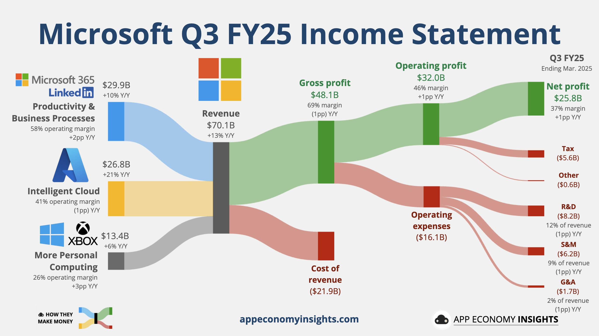
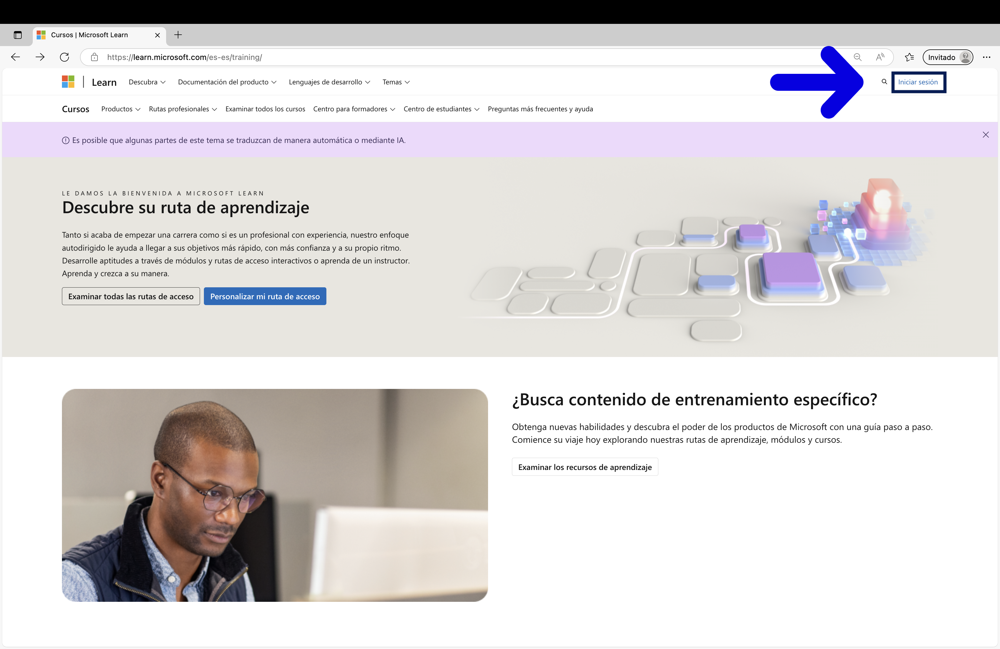
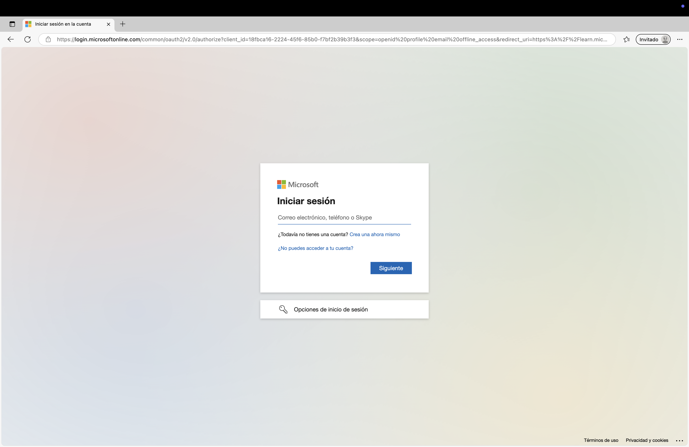
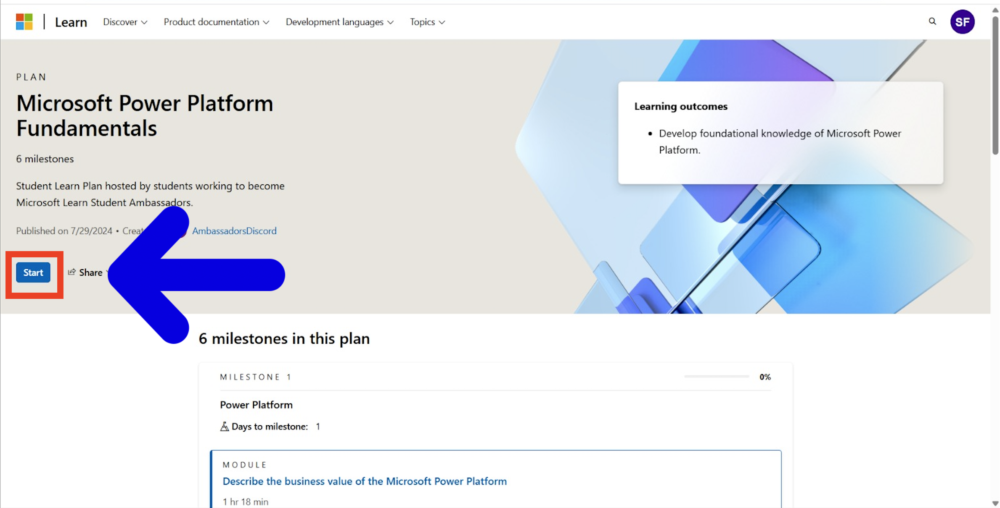
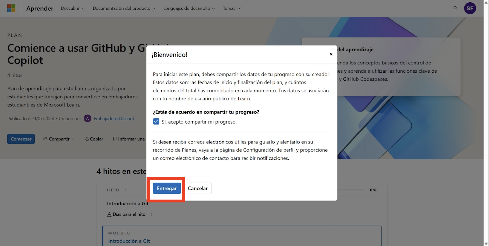
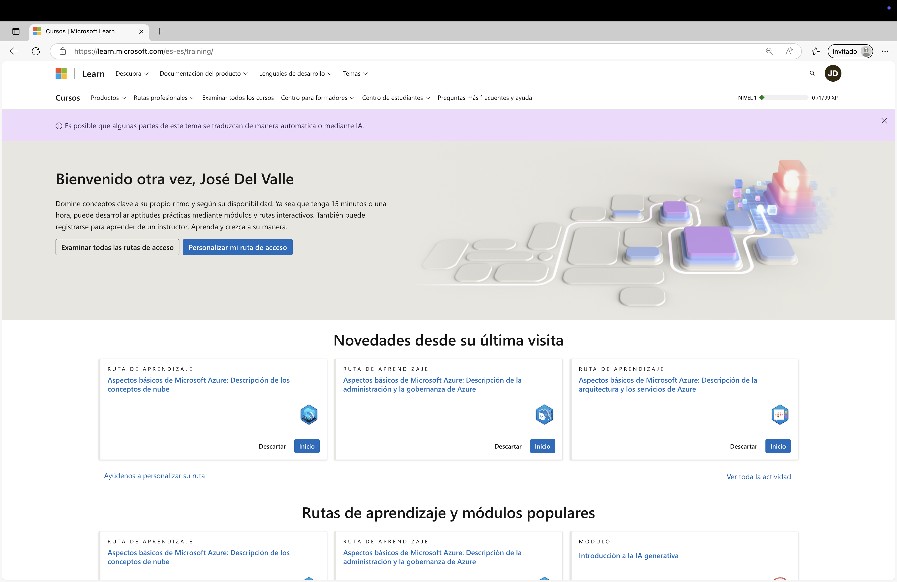

# MLSA

# 📚 Microsoft Learn Learning Paths

This repository gathers some of the main free Microsoft learning paths to help you develop skills in cloud, AI, data, security, development, and more.

---
> ⚠️ **Important note:**  
> After entering the course, **make sure to click the “Start” button** on the left side of the page. ([Step 4](./img/cap45.jpg))  
>  
> 🔒 **If you don’t click “Start,” your progress won’t be saved** and you won’t be able to track your progress or share it with your team or community.

## 🗂️ Courses

| Course | Link |
|--------|--------|
| Azure Fundamentals | [Go to course](https://learn.microsoft.com/en-us/plans/qdwwbm3p0x7gom?tab=tab-created&learnerGroupId=511b4e1a-a04b-42b1-8529-b5ca3b9d85da&wt.mc_id=studentamb_454878) |
| Azure AI Fundamentals | [Go to course](https://learn.microsoft.com/en-us/plans/8pkkiy5x76oy7y?tab=tab-created&learnerGroupId=465c3dfb-e4c5-4d6b-8aa3-af35237bd6dc&wt.mc_id=studentamb_454878) |
| Azure Data Fundamentals | [Go to course](https://learn.microsoft.com/en-us/plans/8pkkiy5xgxnpmw?tab=tab-created&learnerGroupId=5a196ebf-046f-425b-baf3-9234a6fcb59c&wt.mc_id=studentamb_454878) |
| Microsoft Power Platform Fundamentals | [Go to course](https://learn.microsoft.com/en-us/plans/zkddhk2dw1d1op?tab=tab-created&learnerGroupId=91dd9633-d2b1-4073-8a6a-d971537dba35&wt.mc_id=studentamb_454878) |
| Microsoft Security, Compliance, and Identity Fundamentals | [Go to course](https://learn.microsoft.com/en-us/plans/5dyyborpmok24n?tab=tab-created&learnerGroupId=fe237206-bf5d-483f-9d0f-281b6f5e925b&wt.mc_id=studentamb_454878) |
| Microsoft 365 Copilot | [Go to course](https://learn.microsoft.com/en-us/plans/o1mmcm6o12jygw?tab=tab-started&source=docs&learnerGroupId=b487643d-bde1-44ed-868d-76b47f83e61d&wt.mc_id=studentamb_454878) |
| Introduction to GitHub and GitHub Copilot | [Go to course](https://learn.microsoft.com/en-us/plans/gm88tr6o5y5zyk?tab=tab-created&learnerGroupId=1aec470a-1865-405c-9dc8-9ba905b3f53a&wt.mc_id=studentamb_454878) |
| Get Started with C# | [Go to course](https://learn.microsoft.com/en-us/plans/31zzc4mw2wk5re?tab=tab-started&source=docs&learnerGroupId=4ba326f3-5f36-4247-a054-66553b74f710&wt.mc_id=studentamb_454878) |

> 📌 Click the course name to access its content directly.

---

## 🧠 About these courses

Azure is part of the "Intelligent Cloud" segment, which generated $26.8 billion USD in revenue, growing 21% year over year.

This segment represents a huge part of Microsoft's business, with an operating margin of 41%.

Microsoft is betting heavily on the cloud. Learning Azure gives you access to cutting-edge tools and a fast-growing job market with high demand.

So learning Azure means tapping into one of the main revenue engines of one of the most important tech companies in the world. 💼🚀

---

### 🔍 What will you learn?

These Microsoft Learn courses are designed to give you a solid foundation in key areas of modern technology:

- **☁️ Cloud Computing** – Understand how cloud services work and how to deploy them using Azure.
- **🤖 Artificial Intelligence** – Explore AI fundamentals and how to apply them using Microsoft tools.
- **📊 Data and Analytics** – Learn how data is stored, managed, and analyzed at scale.
- **🔐 Security and Compliance** – Discover how to protect data and comply with modern standards.
- **⚙️ Power Platform and Automation** – Build low-code apps and automate workflows with ease.
- **💻 Software Development** – Improve your programming skills with C#, GitHub, and GitHub Copilot.

---

## 🚀 Get started with Microsoft Learn

Follow these quick steps to start your journey on Microsoft Learn and access the courses above:

### 📝 Step-by-step guide

1. **Go to Microsoft Learn website**  
   📷 

   👉 [https://learn.microsoft.com](https://learn.microsoft.com)

2. **Create an account or sign in with a Microsoft account**  
   📷   
   You can use a personal email (Outlook, Hotmail, etc.) or your school email.

3. **Click on the course link in the table above**  
   This will take you directly to the course page.  
   [🗂️ Courses](https://github.com/JoseDelVallee/MLSA)

4. **Click “Start” and share your progress**  
   ✨ **This step is VERY important!**  
   📷   
   📷   
   Clicking “Start” will begin tracking your progress and allow you to share it with your team or community.

5. **Start learning!**  
   📷   
   The platform automatically saves your progress — no need to finish all at once.

## 📤 Submit your completion certificate

Once you finish a course, please submit your completion proof using this form:

👉 [**Submit evidence here**](https://docs.google.com/forms/d/e/1FAIpQLSc-PVQR8njxZKZtbnTkb5tZIz8-ICPguZmwyZnrtvKr1EfDlw/viewform?usp=sharing&ouid=116941962524305950926)

> This helps us track your progress and recognize your effort. 🌟

> This helps us keep track of your progress and recognize your efforts. 🌟

